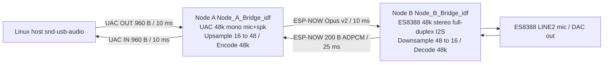

# ESP-NOW Bidirectional Audio Bridge

This document describes the full-duplex wireless USB audio bridge: host speaker playback to the A1S kit and A1S microphone capture back to the host, both over ESP-NOW through the ESP32-S3 dongle.

For the broken Arduino `USBAudioCard` mic path and the move to ESP-IDF `usb_device_uac`, see [Node_A_USB_Debug_v3_idf/DEBUGGING_JOURNEY.md](../Node_A_USB_Debug_v3_idf/DEBUGGING_JOURNEY.md).

For the earlier mic-only ESP-NOW link, see [Node_A_Mic_Test_v2_idf/MIC_LINK_JOURNEY.md](../Node_A_Mic_Test_v2_idf/MIC_LINK_JOURNEY.md).

For the speaker-only failure on the bridge (bisection Tests C / B / A, mono UAC, LED vs ESP-NOW), see [SPEAKER_BISECTION_JOURNEY.md](SPEAKER_BISECTION_JOURNEY.md).

---

## 1. Goal

**End-to-end paths:**

```
Host speaker OUT -> Node A UAC -> ESP-NOW -> Node B DAC -> A1S headphone/speaker
A1S mic IN -> Node B ADC -> ESP-NOW -> Node A UAC -> Host mic IN
```

Both directions run at the same time. FreeRTOS tasks are pinned so WiFi/ESP-NOW codec work stays on **Core 0** and USB UAC + status LED on **Core 1** (Node A).

**Status (May 2026):** Verified on hardware with [Node_A_Bridge_idf](.) + [Node_B_Bridge_idf](../Node_B_Bridge_idf/) — simultaneous host playback and UAC mic capture. Node B reaches ~100 speaker frames/s (ESP-IDF full-duplex I2S). See [BRIDGE_B_IDF_JOURNEY.md](../Node_B_Bridge_idf/BRIDGE_B_IDF_JOURNEY.md) for the Node B migration and debug log.

---

## 2. Prior art in this repo

| Project | Role | Status |
|---------|------|--------|
| [Node_A_USB_Debug_v3_idf](../Node_A_USB_Debug_v3_idf/) | ESP-IDF UAC mic-only, synthetic tone @ 48 kHz | USB mic baseline |
| [Node_A_Mic_Test_v2_idf](../Node_A_Mic_Test_v2_idf/) | ESP-NOW mic -> UAC @ 16 kHz | Mic wireless link |
| [Node_A_Audio](../Node_A_Audio/) | Arduino USB **speaker** + ESP-NOW (44.1 kHz stereo) | Broken Arduino mic; speaker path reference |
| [Node_B_Audio](../Node_B_Audio/) | ESP-NOW speaker **receiver** + I2S play | Speaker decode reference |
| [Node_B_Mic_Test](../Node_B_Mic_Test/) | Mic capture + ESP-NOW transmit @ 16 kHz | Mic encode reference |
| **This project** | [Node_A_Bridge_idf](.) + [Node_B_Bridge_idf](../Node_B_Bridge_idf/) | **Full duplex — verified simultaneous** (Node B: ESP-IDF; Arduino fallback) |

Legacy one-way projects are left unchanged as fallbacks.

---

## 3. Architecture



---

## 4. Wire formats

### Mic direction (Node B -> Node A -> host)

| Field | Value |
|-------|--------|
| Transport | ESP-NOW, channel **1**, no encryption |
| Packet size | **200 bytes** (fixed) |
| Codec | IMA ADPCM, 4 bits/sample, 2 nibbles/byte |
| PCM after decode | **400** x `int16_t` @ **16 kHz mono** = 25 ms |
| Node A USB | Upsample **3x linear** -> **1200** samples @ 48 kHz -> UAC mic |

### Speaker direction (host -> Node A -> Node B)

| Field | Value |
|-------|--------|
| Transport | ESP-NOW, channel **1** |
| Codec (default) | **Opus** mono via `esphome/micro-opus`, **128 kb/s**, 10 ms frames |
| Packet size | Variable **≤ 250 B** (ESP-NOW max); v2 header: `0x4F` + opus_len + payload |
| PCM per frame | **480** x `int16_t` @ **48 kHz mono** = 10 ms |
| Legacy fallback | **240 B** fixed → IMA ADPCM (rollback; Node B still decodes) |
| Node B output | Decode mono -> duplicate L/R -> ES8388 DAC @ 48 kHz stereo |
| Shared header | [`bridge_spk.h`](../bridge_spk.h) |

Routing: **mic** = exactly **200 B**; **speaker** = **240 B** (legacy ADPCM) or **v2 Opus** (`bridge_spk_is_opus_pkt()`). Mic wire format unchanged.

**Duplex test after speaker codec change:** host plays + records ESP mic; Node B log shows `[Mic] Sent:~40` `Peak>0` and `[Spk] played≈recv` `dropthru:0`.

**Node A (ESP32-S3 N16R8):** Opus encode needs **OPI PSRAM** in [`sdkconfig.defaults`](Node_A_Bridge_idf/sdkconfig.defaults) (`CONFIG_SPIRAM=y`). Delete `sdkconfig.esp32s3_n16r8` after changing defaults.

**Node B (A1S ESP32-WROOM, no PSRAM):** Opus decode uses a **60 KB** non-threadsafe pseudostack + internal RAM only ([`Node_B_Bridge_idf/sdkconfig.defaults`](../Node_B_Bridge_idf/sdkconfig.defaults)). Boot log: `heap SPIRAM free=0` and `Opus warmup OK`. Stats line includes `opus_ok` / `opus_fail`.

**ADPCM fallback (if Node B cannot run Opus):** Revert Node A [`spk_tx_task`](Node_A_Bridge_idf/src/main.c) to send **240 B IMA ADPCM** (pre-Opus loop). Node B legacy ADPCM decode path remains. Mic wire format unchanged.

Peer MACs: [`peers.h`](../peers.h) (`nodeAAddress` / `nodeBAddress`). Node A also hardcodes Node B in [`src/main.c`](src/main.c) — re-run `auto_mac_setup.sh` if boards change.

---

## 5. Sample-rate decision (48 kHz USB + 16 kHz wireless mic)

`usb_device_uac` 1.2.3 exposes a **single** `UAC2_ENTITY_CLOCK` and one `CONFIG_UAC_SAMPLE_RATE` for both mic and speaker ([`uac_descriptors.h`](../Node_A_USB_Debug_v3_idf/components/usb_device_uac/tusb_uac/uac_descriptors.h)). You cannot advertise 48 kHz speaker and 16 kHz mic on the same device without patching descriptors.

**Chosen approach (option A):**

- USB descriptor: **48 kHz mono** for mic and speaker.
- Wireless mic: stay **16 kHz mono ADPCM** (proven in `Node_B_Mic_Test`).
- Node A **upsamples 3x** with linear interpolation before `uac_input_cb`.
- Wireless speaker: **48 kHz mono Opus** (v2); legacy **240 B ADPCM** still accepted on Node B.

This keeps the vendored `usb_device_uac` patch unchanged and matches Linux/Audacity expectations for a 48 kHz headset.

---

## 6. Task and core pinning

### Node A (ESP32-S3)

| Core | Work |
|------|------|
| 0 | WiFi stack, ESP-NOW recv (decode + upsample), `spk_tx_task` (encode + send) |
| 1 | TinyUSB / `usb_device_uac` (`uac_input_cb`, `uac_output_cb`), LED, stats |

`CONFIG_UAC_*_TASK_CORE=1`, `CONFIG_ESP_WIFI_TASK_CORE_ID=0` in [`sdkconfig.defaults`](sdkconfig.defaults).

### Node B (A1S, ESP-IDF)

| Core | Work |
|------|------|
| 0 | WiFi / ESP-NOW, `mic_task` (I2S RX, downsample, ADPCM encode, `esp_now_send`) |
| 1 | `speaker_task` (queue recv, ADPCM decode, I2S TX) — no `i2sMutex`; separate `tx_chan` / `rx_chan` |

---

## 7. StreamBuffers and pacing (Node A)

| Buffer | Size | Producer | Consumer |
|--------|------|----------|----------|
| `s_mic_stream` | 14400 B (~6 x 25 ms) | ESP-NOW recv | `uac_input_cb` every 10 ms (960 B) |
| `s_spk_stream` | 5760 B (~6 x 10 ms) | `uac_output_cb` | `spk_tx_task` every 10 ms (960 B) |

| Condition | Policy |
|-----------|--------|
| Mic underrun | Zero-fill in `uac_input_cb`; always return full frame |
| Mic overflow | Drop tail on `xStreamBufferSend(..., 0)` |
| Spk overflow | Drop tail in `uac_output_cb` |
| Spk TX idle | `spk_tx_task` blocks on empty buffer |

---

## 8. LED states (Node A, GPIO 48)

Same semantics as bisection tests (`Node_A_Spk_Mic_Test_*`): colors reflect **host USB streams**, not always-on ESP-NOW mic from Node B (Node B sends mic packets continuously; that used to force solid green at idle).

| Pattern | Meaning |
|---------|---------|
| 5x white flash | Boot OK |
| Slow blue pulse | Idle — host has not opened mic or speaker UAC streams recently |
| Solid green | Host **recording** (USB mic IN / `uac_input_cb` active) |
| Solid magenta | Host **playback** (USB speaker OUT / `uac_output_cb` active) |
| Solid white | Host recording and playing at the same time |

Check `stats_task` logs for `spk_uac`, `spk_ov`, `now_ok`, and `mic_rx` if audio fails while the LED looks correct.

### Speaker silent but LED magenta (host playback OK)

`usb_device_uac` calls `uac_output_cb` with **~96 bytes** per USB read (`spk_bytes_per_ms`), not 960 bytes at once. `spk_tx_task` must assemble **960 bytes** before ESP-NOW encode.

**Bug (fixed):** `xStreamBufferReceive(..., 15 ms timeout)` could return a **partial** buffer on timeout; those bytes were discarded and frame alignment was lost → no usable audio on Node B. Fix: wait until `xStreamBufferBytesAvailable >= 960`, then receive with **zero** timeout.

On Node B, `micTask` holds `i2sMutex` during a large `readBytes`; `speakerTask` could miss the mutex or drop queued packets. Fix: higher priority for `speakerTask`, `xQueueSendFromISR` in `onDataRecv`, longer speaker mutex wait.

### Playback: chipmunk, static, or very quiet (duplex works)

IMA ADPCM has **no packet headers**; a lost or burst-played frame corrupts the decoder until the next resync. Full duplex makes that worse (mic + speaker share ESP-NOW).

**Mitigations (in firmware):**

- **Node A:** Pace speaker ESP-NOW to one 240 B packet every **10 ms**; drop PCM backlog above ~3 frames and reset the encoder; offload mic decode from the WiFi callback to `mic_rx_task`.
- **Node B:** Play one frame every **10 ms** (`vTaskDelayUntil`); trim speaker queue to ≤3 frames (reset decoder on drops); reset decoder after **>18 ms** gap between packets; DAC volume 55.

Speaker path uses **Opus** (self-contained frames). Mic remains **ADPCM** @ 16 kHz. Residual issues are mostly wireless jitter, not speaker codec timbre.

### Node A reboots when host starts playback

**Cause:** `uac_output_cb` ran on the small `usb_spk_task` stack and called `spk_discard_backlog_frames()`, which allocated **960 bytes** of `int16_t trash[]` locally → stack overflow → panic/reboot (fast white LED flicker, then blue idle).

**Also:** `xQueueSendFromISR` in the ESP-NOW recv callback is wrong on ESP-IDF 5.x (callback is WiFi task context, not ISR).

**Fix:** Discard backlog only in `spk_tx_task`; use static PCM scratch buffers; do not call discard from `uac_output_cb`.

**Boot loop (watchdog):** `spk_tx_task` advanced `next_tx` without `vTaskDelay` when the speaker stream was empty → tight loop → TWDT reset. Fix: `vTaskDelay(1)` while waiting for 960 bytes; drop the broken TX pacing loop.

---

## 9. Build, flash, and test

### Prerequisites

Same as other IDF nodes: `platformio-core`, `python-pip`, `arduino-cli`, `jq`.

### Build Node A only

```bash
cd Node_A_Bridge_idf
pio run
```

### Flash both nodes

```bash
cd ~/project/Thesis
chmod +x flash_bridge.sh   # once
./flash_bridge.sh
```

If the S3 serial port is missing, hold **BOOT**, tap **RST**, release **BOOT**, re-run.

### Verify on Linux

```bash
arecord -l
# Mic path (speak into A1S LINE2):
arecord -D plughw:CARD=Device,DEV=0 -f S16_LE -r 48000 -c 1 -d 5 /tmp/mic.wav
aplay /tmp/mic.wav

# Speaker path (host -> A1S):
aplay -D plughw:CARD=Device,DEV=0 -f S16_LE -r 48000 -c 1 /path/to/mono48k.wav
```

In **Audacity:** device = ESP UAC, **48000 Hz**, **mono** for record; use the same device for playback monitor if needed.

---

## 10. Troubleshooting

| Symptom | Likely cause | What to check |
|---------|----------------|---------------|
| LED stays **blue** | No ESP-NOW | Power both boards; channel 1; [`peers.h`](../peers.h) MACs |
| **Green** only, no speaker on A1S | Host not playing to UAC OUT | `aplay -D plughw:CARD=Device,DEV=0 -f S16_LE -r 48000 -c 1 file.wav`; Node A LED should go magenta/white; serial `spk_uac=` bytes increasing |
| **Magenta** only, no sound on A1S | Node B not playing ESP-NOW packets | Node B serial `[Spk] frames/s:` should rise when host plays; speaker uses **`i2s.write()`** (not `AudioBoardStream::write` in RX_MODE) |
| **Magenta** only, no mic on PC | Node B not sending mic | Node B serial `[Mic] Sent:`; 200-byte packets only |
| Distorted mic | Upsample edge | Normal at link start; check `mic_ov` / `mic_un` stats on Node A serial |
| Mic loud / noisy / harsh | High ES8388 PGA before ADPCM on Node B | Lower `MIC_IN_GAIN_DB` in [`Node_B_Bridge_idf/src/main.c`](../Node_B_Bridge_idf/src/main.c) (0–24 dB; default **6**); reflash Node B only; use host gain in Audacity if too quiet |
| `pio run` duplicate `usb_descriptors.c.o` | Missing v3 vendored UAC | `override_path` in [`src/idf_component.yml`](src/idf_component.yml) |
| `Failed to resolve component 'esp_now'` | Bad CMake REQUIRES | Use **`esp_wifi`** only in [`src/CMakeLists.txt`](src/CMakeLists.txt) |
| `unknown type name 'esp_now_send_info_t'` | ESP-IDF 5.4 send CB API | Send callback is `void (*)(const uint8_t *mac_addr, esp_now_send_status_t)` — not `esp_now_send_info_t` (that type is recv-only) |
| LED stuck blue, mic also dead | Node B `i2s.setPins(..., din=-1, ...)` | A1S ADC pin is GPIO 35; correct call is `i2s.setPins(27, 25, 26, 35, 0)` (BCLK, LRCK, DSDIN, ASDOUT, MCLK) |
| LED green/blue but never magenta | Host not routing output to ESP UAC | `aplay -l` should list the card; in PulseAudio/PipeWire pick the ESP device as Output and unmute; play **48 kHz mono** PCM |
| Sink shows RUNNING in `pactl` but Node A `spk_uac=0` | `CFG_TUD_AUDIO_FUNC_1_N_AS_INT` too low in vendored `usb_device_uac` | Must equal 2 when both `SPEAK_CHANNEL_NUM` and `MIC_CHANNEL_NUM` are non-zero; otherwise the speaker AS interface is silently ignored and `uac_output_cb` never fires. Patched in [`tusb_config_uac.h`](../Node_A_USB_Debug_v3_idf/components/usb_device_uac/tusb_uac/tusb_config_uac.h) |
| `arecord` I/O error on Node A | Wrong firmware | Flash **this** project, not Arduino `Node_A_Mic_Test` |

---

## 11. Project file map

| File | Role |
|------|------|
| [`platformio.ini`](platformio.ini) | S3 N16R8, ESP-IDF |
| [`sdkconfig.defaults`](sdkconfig.defaults) | 48 kHz UAC mic+spk, core pinning, WiFi buffers |
| [`src/main.c`](src/main.c) | Full bridge logic |
| [`src/CMakeLists.txt`](src/CMakeLists.txt) | `esp_wifi` (not `esp_now`) |
| [`src/idf_component.yml`](src/idf_component.yml) | Patched `usb_device_uac`, `led_strip` |
| [`../Node_B_Bridge_idf/`](../Node_B_Bridge_idf/) | A1S duplex firmware (ESP-IDF, primary) |
| [`../Node_B_Bridge_idf/BRIDGE_B_IDF_JOURNEY.md`](../Node_B_Bridge_idf/BRIDGE_B_IDF_JOURNEY.md) | Node B migration + post-port debug journey |
| [`../Node_B_Bridge/Node_B_Bridge.ino`](../Node_B_Bridge/Node_B_Bridge.ino) | A1S duplex firmware (Arduino fallback) |
| [`../flash_bridge.sh`](../flash_bridge.sh) | One-shot flash both nodes |
| [`../AUDIO_IMPROVEMENT.md`](../AUDIO_IMPROVEMENT.md) | Speaker codec quality, 128 kb/s upgrade, verify & troubleshoot |

---

## References

- [AUDIO_IMPROVEMENT.md](../AUDIO_IMPROVEMENT.md) — Opus speaker bitrate and quality tuning
- [BRIDGE_B_IDF_JOURNEY.md](../Node_B_Bridge_idf/BRIDGE_B_IDF_JOURNEY.md) — Node B migration, simultaneous duplex verified, I2C/LINE2/gain debug journey
- [SPEAKER_BISECTION_JOURNEY.md](SPEAKER_BISECTION_JOURNEY.md) — isolated speaker-path tests (motivated Node B port)
- [DEBUGGING_JOURNEY.md](../Node_A_USB_Debug_v3_idf/DEBUGGING_JOURNEY.md)
- [MIC_LINK_JOURNEY.md](../Node_A_Mic_Test_v2_idf/MIC_LINK_JOURNEY.md)
- [arduino-esp32 #12518](https://github.com/espressif/arduino-esp32/issues/12518)
- [usb_device_uac component](https://components.espressif.com/components/espressif/usb_device_uac)
