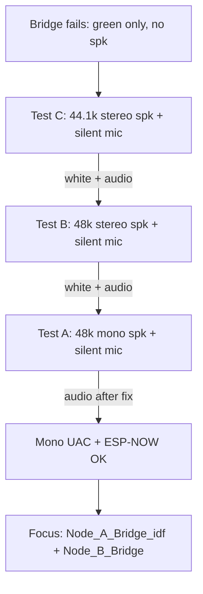

# Bridge Speaker Path — Bisection Debug Journey

This document records how we isolated why **`Node_A_Bridge_idf`** showed a working USB microphone (solid green LED) but **no speaker playback** on the A1S kit, using a chain of minimal ESP-IDF test firmwares on Node A paired with the known-good Arduino receiver **`Node_B_Audio.ino`**.

Related docs:

- [BRIDGE_JOURNEY.md](BRIDGE_JOURNEY.md) — full duplex bridge design and wire formats
- [DEBUGGING_JOURNEY.md](../Node_A_USB_Debug_v3_idf/DEBUGGING_JOURNEY.md) — move from Arduino `USBAudioCard` to `usb_device_uac`
- [MIC_LINK_JOURNEY.md](../Node_A_Mic_Test_v2_idf/MIC_LINK_JOURNEY.md) — 16 kHz mic ESP-NOW link

---

## 1. Starting symptom (bridge)

| Observation | Meaning |
|-------------|---------|
| Solid **green** LED on Node A | `uac_input_cb` / mic path active |
| No **magenta** or **white** | `uac_output_cb` not seen as “live” in bridge LED logic, or no ESP-NOW speaker TX |
| Mic works on Linux | Host → Node B → Node A → host mic path OK |
| No sound on A1S speaker | Host → Node A → Node B speaker path broken |

`lsusb` showed both AudioStreaming interfaces (speaker + microphone) with plausible endpoints. PipeWire listed a **48 kHz mono** USB playback sink. The host *could* open playback; data was not reaching the kit.

---

## 2. First fix: dual AudioStreaming interfaces (`N_AS_INT`)

In the vendored [`usb_device_uac`](../Node_A_USB_Debug_v3_idf/components/usb_device_uac/tusb_uac/tusb_config_uac.h), `CFG_TUD_AUDIO_FUNC_1_N_AS_INT` was hardcoded to `1`. With **both** mic and speaker enabled, TinyUSB only registered **one** AudioStreaming interface, so the speaker path never came up correctly.

**Patch:**

```c
#if SPEAK_CHANNEL_NUM && MIC_CHANNEL_NUM
#define CFG_TUD_AUDIO_FUNC_1_N_AS_INT             2
#else
#define CFG_TUD_AUDIO_FUNC_1_N_AS_INT             1
#endif
```

After this patch, the bridge still failed (green only, no speaker). Bisection was required to separate **descriptor / dual-AS**, **sample rate**, **channel count**, and **application logic**.

---

## 3. Why bisection used `Node_B_Audio` (Arduino)

The old one-way pair **`Node_A_Audio.ino`** + **`Node_B_Audio.ino`** (44.1 kHz **stereo** ADPCM) was a known-good wireless speaker path. New Node A firmware is ESP-IDF + the same patched `usb_device_uac`. Isolation tests keep **Node B unchanged** and only vary Node A UAC settings and minimal send logic, so failures stay on the dongle/USB side.

---

## 4. Test matrix and results

| Test | Project | UAC speaker | UAC mic | Rate | Result |
|------|---------|-------------|---------|------|--------|
| **Baseline** | `Node_A_Audio_idf` | stereo | off | 44.1 kHz | Audio OK (speaker-only IDF) |
| **C** | `Node_A_Spk_Mic_Test_idf` | stereo | silent mono | 44.1 kHz | **Pass** — white LED, audio OK |
| **B** | `Node_A_Spk_Mic_Test_48k_idf` | stereo | silent mono | 48 kHz | **Pass** — white LED, audio OK (pitch ~9% off on B) |
| **A** | `Node_A_Spk_Mic_Test_48k_mono_idf` | **mono** | silent mono | 48 kHz | **Pass** (after accumulator fix) — audio present, artifacts expected |

Flash scripts (repo root):

| Script | Pair |
|--------|------|
| `./flash_audio_idf.sh` | `Node_A_Audio_idf` + `Node_B_Audio` |
| `./flash_spk_mic_test.sh` | Test C |
| `./flash_spk_mic_test_48k.sh` | Test B |
| `./flash_spk_mic_test_48k_mono.sh` | Test A |

### Host commands (Tests B & A — 48 kHz)

Open **both** AS interfaces (mic keeps host from sleeping the device):

```bash
arecord -D plughw:CARD=Device,DEV=0 -f S16_LE -r 48000 -c 1 -d 30 /tmp/silent.wav &
# Test B (stereo UAC):
speaker-test -D plughw:CARD=Device,DEV=0 -c 2 -r 48000 -f 440 -t sine -l 1
# Test A (mono UAC):
speaker-test -D plughw:CARD=Device,DEV=0 -c 1 -r 48000 -f 440 -t sine -l 1
```

### LED meaning (bisection builds)

| LED | Interpretation |
|-----|----------------|
| **White** | Mic USB active **and** speaker path sending ESP-NOW (Test A: after fix, requires real packets) |
| **Magenta** | Speaker ESP-NOW only |
| **Green** | Mic USB only — **does not** prove speaker works |
| **Blue blink** | Host not streaming |
| **Red blink** | ESP-NOW send failures |

Node B confirmation: serial monitor should report roughly **`~140 kbps`** on the `[Node B] Receiving:` line while audio plays.

---

## 5. What each test ruled out



| Ruled out | Evidence |
|-----------|----------|
| Dual AS interfaces (`N_AS_INT=2`) alone | Test C @ 44.1 kHz |
| 48 kHz sample rate alone | Test B @ 48 kHz stereo |
| Mono speaker UAC + host playback | Test A @ 48 kHz mono (with working send path) |
| Patched `usb_device_uac` cannot do speaker OUT in IDF | `Node_A_Audio_idf` + Tests C/B/A |

**Still open after bisection:** bugs specific to **`Node_A_Bridge_idf`** (StreamBuffers, task pinning, concurrent mic+spk load) or **`Node_B_Bridge`** (I2S, 48 kHz mono wire format vs `Node_B_Audio` stereo reference tests).

---

## 6. Test A false positive: white LED without audio

Early Test A turned **white** while **no sound** played on the kit. Cause:

1. `usb_device_uac` calls `uac_output_cb` with **`spk_bytes_per_ms`** per USB read (~**96 bytes** = 48 mono samples @ 48 kHz), not a full 10 ms (960 byte) frame.
2. Test A only called `esp_now_send` when a **single** callback contained ≥ **240** samples — that never happened.
3. The LED treated **any** `uac_output_cb` as “speaker live,” so USB looked fine while **zero** ESP-NOW packets were sent.

**Fix:** accumulate mono samples across callbacks (same pattern as Test B / `Node_A_Audio_idf`), duplicate mono → L/R for the **stereo** ADPCM wire format expected by `Node_B_Audio.ino`, then send 240-byte packets. Speaker LED was tied to **ESP-NOW activity**, not raw USB callbacks.

---

## 7. Test A audio artifacts — expected, not a failure

After the fix, audio returned but often sounded **wrong**: random pitch wobble, sometimes very loud, sometimes barely audible.

**This does not fail the bisection.** The goal was to prove **host mono playback → Node A encode → ESP-NOW → Node B decode → DAC**, not Hi-Fi quality.

| Factor | Effect |
|--------|--------|
| **48 kHz UAC vs 44.1 kHz I2S on Node B** | Steady ~8.8% rate mismatch (`48000/44100`); B still runs `RATE_44K` in `Node_B_Audio.ino` |
| **Mono duplicated to L+R** | Valid for the reference decoder; both channels carry the same ADPCM |
| **ESP-NOW jitter / drops** | IMA ADPCM has **no** per-packet state reset; loss or reorder causes decoder blow-ups (loud noise) or collapse (quiet) |
| **Bursty USB chunk delivery** | Variable time between 240-sample packets → playback clock on B drifts → pitch wanders |
| **WiFi vs USB + optional `arecord`** | Extra airtime contention when both AS interfaces are open |

The **bridge** uses **48 kHz mono ADPCM** end-to-end with **`Node_B_Bridge`**, not stereo-duplicated-to-`Node_B_Audio`. Clean pitch on the product path requires matching rates on B and stable pacing — a **tuning** task, not part of this bisection.

**Bisection success criteria (Test A):**

- [x] `uac_output_cb` runs under **48 kHz mono** with mic interface also enabled  
- [x] ESP-NOW packets sent (magenta/white LED, Node B kbps line)  
- [x] Audible output on the kit (quality artifacts acceptable for this test)

---

## 8. Conclusion

1. **`CFG_TUD_AUDIO_FUNC_1_N_AS_INT=2`** was necessary but **not sufficient** for the bridge.  
2. **Dual AS + 48 kHz + stereo** works (Tests C, B).  
3. **Dual AS + 48 kHz + mono speaker** works at the USB/ESP-NOW level (Test A, after accumulator fix).  
4. The original bridge speaker failure is **not** explained by “mono UAC cannot receive from Linux.” Next work belongs in **`Node_A_Bridge_idf`** and **`Node_B_Bridge`** (full duplex, mono wire format, StreamBuffer pacing, I2S on B).

---

## 9. Recommended next steps

1. Re-flash **`./flash_bridge.sh`** and compare bridge LED to bisection (magenta/white on speaker traffic).  
2. On Node B bridge firmware, confirm **`i2s.write`** path and **`din`** pin for mic (see [BRIDGE_JOURNEY.md](BRIDGE_JOURNEY.md) history).  
3. Align **`spk_tx_task`** pacing with `spk_bytes_per_ms` chunking (bridge already uses StreamBuffer; verify 480-sample frames are assembled reliably).  
4. Optionally add a **Test A′** that pairs Test A Node A with **`Node_B_Bridge`** at 48 kHz mono ADPCM to separate dongle vs kit decode in one step.

---

## 10. Project reference

| Directory | Role |
|-----------|------|
| `Node_A_Audio_idf/` | Speaker-only isolation (44.1 kHz stereo) |
| `Node_A_Spk_Mic_Test_idf/` | Test C |
| `Node_A_Spk_Mic_Test_48k_idf/` | Test B |
| `Node_A_Spk_Mic_Test_48k_mono_idf/` | Test A |
| `Node_A_Bridge_idf/` | Production dongle firmware |
| `Node_B_Audio/` | Bisection receiver (44.1 kHz stereo ADPCM) |
| `Node_B_Bridge/` | Production kit firmware |
