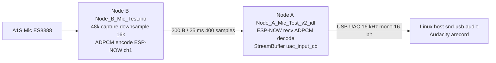

# ESP-NOW → USB UAC Microphone Link

This document explains how the A1S Audio Kit (Node B) microphone reaches the Linux host through the ESP32-S3 dongle (Node A), why the design choices were made, and how to build, flash, and test the link.

For the earlier diagnosis of the broken Arduino `USBAudioCard` microphone path and the move to ESP-IDF + `usb_device_uac`, see [Node_A_USB_Debug_v3_idf/DEBUGGING_JOURNEY.md](../Node_A_USB_Debug_v3_idf/DEBUGGING_JOURNEY.md).

---

## 1. Goal

**Node B** captures audio from the ES8388 codec on the A1S board, compresses it, and sends it over **ESP-NOW**.

**Node A** receives those packets, decodes them to PCM, and presents a **USB Audio Class (UAC) microphone** to the PC so Linux tools (`arecord`, Audacity, Google Meet) see a normal mic device.

End-to-end path:

```
A1S mic → Node B (encode + ESP-NOW) → Node A (decode + UAC) → Linux host
```

---

## 2. Prior art in this repo

| Project | Role | Status |
|---------|------|--------|
| [`Node_A_Mic_Test/Node_A_Mic_Test.ino`](../Node_A_Mic_Test/Node_A_Mic_Test.ino) | Arduino dongle: ESP-NOW recv + ADPCM decode + `USBAudioCard::write()` | ESP-NOW + decode logic is correct; **USB mic path broken** (arduino-esp32 #12518) |
| [`Node_B_Mic_Test/Node_B_Mic_Test.ino`](../Node_B_Mic_Test/Node_B_Mic_Test.ino) | Arduino transmitter: I2S capture, downsample, ADPCM encode, ESP-NOW send | **Unchanged** — contract for this link |
| [`Node_A_Audio/Node_A_Audio.ino`](../Node_A_Audio/Node_A_Audio.ino) | USB **speaker** (host → device) + ESP-NOW forward | Works; opposite direction |
| [`Node_A_USB_Debug_v3_idf/`](../Node_A_USB_Debug_v3_idf/) | ESP-IDF UAC mic with **synthetic tone** | Proved IDF `usb_device_uac` works on Linux; kept as baseline |

**This project:** [`Node_A_Mic_Test_v2_idf/`](.) — same wireless contract as `Node_A_Mic_Test`, same UAC stack as `Node_A_USB_Debug_v3_idf`, but PCM comes from ESP-NOW instead of a tone generator.

---

## 3. Architecture



### Task layout (Node A)

| Core | Work |
|------|------|
| 0 | WiFi + ESP-NOW receive callback (`on_now_recv`) |
| 1 | TinyUSB / `uac_input_cb` (via `usb_device_uac`), LED task, stats log |

Decode runs **inside** the ESP-NOW callback (~400 ADPCM steps per packet, well under 1 ms). No separate decode task.

---

## 4. Wire format (Node B → Node A)

Must match [`Node_B_Mic_Test.ino`](../Node_B_Mic_Test/Node_B_Mic_Test.ino) exactly.

| Field | Value |
|-------|--------|
| Transport | ESP-NOW, WiFi channel **1**, no encryption |
| Packet size | **200 bytes** (fixed; other lengths are dropped) |
| Codec | IMA ADPCM, 4 bits per sample |
| Packing | One byte = two nibbles: **low nibble** = sample *N*, **high nibble** = sample *N+1* |
| PCM after decode | **400** × `int16_t` = **800 bytes** = **25 ms** @ 16 kHz mono |
| Peer MAC | Node B sends to `nodeAAddress` in [`peers.h`](../peers.h); Node A adds Node B as peer (`nodeBAddress`, hardcoded in `main.c`) |

ADPCM tables and `decodeADPCM()` in [`src/main.c`](src/main.c) are copied verbatim from [`Node_A_Mic_Test.ino`](../Node_A_Mic_Test/Node_A_Mic_Test.ino) so encoder and decoder stay in sync.

---

## 5. Why 16 kHz, not 48 kHz

| Reason | Detail |
|--------|--------|
| Transmitter already fixed | `Node_B_Mic_Test` captures at 48 kHz stereo but **downsamples 3×** and sends **16 kHz mono** ADPCM |
| Bandwidth | ~200 B every 25 ms ≈ 64 kbit/s wireless; 48 kHz would need ~4× more payload or a new encoder |
| Host tools | `arecord` and Audacity accept 16 kHz mono; no resampling required on Node A |
| Use case | Voice-grade link; 16 kHz is sufficient for monitoring and thesis demos |

Node A `sdkconfig.defaults` sets `CONFIG_UAC_SAMPLE_RATE=16000` so the USB descriptor matches the decoded PCM rate (no upsampling).

---

## 6. Producer / consumer pacing

Rates:

- **Producer (ESP-NOW):** one packet every ~25 ms → 800 B PCM
- **Consumer (UAC):** `CONFIG_UAC_MIC_INTERVAL_MS=10` → 320 B per `uac_input_cb` (~10 ms)

Packets arrive slower than the host pulls, so a **FreeRTOS StreamBuffer** (~4800 B ≈ 6 packets ≈ 150 ms) absorbs jitter.

| Condition | Policy |
|-----------|--------|
| **Underrun** (`uac_input_cb` needs more bytes than buffered) | Zero-fill remainder; always return `*bytes_read = len` so the USB isochronous clock never stalls |
| **Overflow** (buffer full when a packet arrives) | Drop tail of packet (`xStreamBufferSend` with 0 timeout); prefer a 25 ms gap over blocking the WiFi task |

Counters `s_overflow_bytes` / `s_underrun_bytes` are logged every 2 s on the serial monitor (when a UART port is available in download mode).

---

## 7. Why a sibling project, not a rewrite of v3

[`Node_A_USB_Debug_v3_idf`](../Node_A_USB_Debug_v3_idf/) stays the **minimal known-good** UAC test (480 Hz square wave, 48 kHz). If the ESP-NOW bridge misbehaves, you can still flash v3 and confirm the USB path alone.

[`Node_A_Mic_Test_v2_idf/`](.) adds WiFi, ESP-NOW, ADPCM, and a StreamBuffer without touching that baseline.

---

## 8. Shared `usb_device_uac` patch (`override_path`)

PlatformIO cannot build `espressif/usb_device_uac` 1.2.3 from the registry without a duplicate `usb_descriptors.c.o` target (see v3 [DEBUGGING_JOURNEY.md section 9](../Node_A_USB_Debug_v3_idf/DEBUGGING_JOURNEY.md#9-platformio-build-issues-encountered)).

This project reuses the **already patched** vendored copy in the v3 tree via [`src/idf_component.yml`](src/idf_component.yml):

```yaml
espressif/usb_device_uac:
  version: "^1.2.3"
  override_path: "../../Node_A_USB_Debug_v3_idf/components/usb_device_uac"
```

Do not duplicate the patch in two folders.

---

## 9. LED states (Node A, GPIO 48 WS2812)

| Pattern | Meaning |
|---------|---------|
| 5× white flash | Boot / firmware reached `app_main` |
| Slow blue pulse | No ESP-NOW packet in the last **200 ms** |
| Solid green | Packets received recently (link active) |

Unlike v3, green is driven by **packet activity**, not the host mute callback. The mute callback only logs to serial.

---

## 10. Build, flash, and test

### Prerequisites (Arch Linux)

Same as v3: `platformio-core`, `python-pip`, `arduino-cli`, `jq`.

### Build Node A only

```bash
cd Node_A_Mic_Test_v2_idf
pio run
```

### Flash both nodes (recommended)

```bash
cd ~/project/Thesis
./flash_mic.sh
```

- **Node A:** `pio run -d Node_A_Mic_Test_v2_idf -t upload`
- **Node B:** `arduino-cli` → [`Node_B_Mic_Test`](../Node_B_Mic_Test/)

If the S3 serial port is missing (USB-audio firmware already running), the script prints BOOT+RST instructions. Hold **BOOT**, tap **RST**, release **BOOT**, then re-run.

### Verify on Linux

```bash
arecord -l
# Example: card 1: Device [ESP UAC Device], device 0: USB Audio

# Use the card *id* (left of brackets), not the long name with spaces:
arecord -D plughw:CARD=Device,DEV=0 -f S16_LE -r 16000 -c 1 -d 5 /tmp/mic.wav
# Or by card number:
arecord -D plughw:1,0 -f S16_LE -r 16000 -c 1 -d 5 /tmp/mic.wav

aplay /tmp/mic.wav
```

In **Audacity:** pick the ESP UAC input, **mono**, **16000 Hz** project rate.

Expected: speak into the A1S mic → waveform in Audacity; `aplay` plays your voice (not the v3 square-wave buzz).

---

## 11. Troubleshooting

| Symptom | Likely cause | What to check |
|---------|----------------|---------------|
| LED stays **blue** | Node A not receiving ESP-NOW | Both boards powered; same channel 1; [`peers.h`](../peers.h) MACs match actual boards (`auto_mac_setup.sh` if boards were swapped) |
| LED **green** but silent / flat waveform | Node B not sending, or wrong packet size | Node B serial: `[TX] Peak: ... Sent: ...`; only **200-byte** packets are accepted on Node A |
| Audacity timeline stuck (no start) | Wrong device or sample rate | Select ESP UAC explicitly; **16000 Hz mono** |
| `arecord: pcm_read: Input/output error` | Regressed to broken Arduino UAC | Reflash **this** IDF project, not `Node_A_Mic_Test.ino` |
| `pio run` duplicate `usb_descriptors.c.o` | Missing v3 vendored component | Ensure `Node_A_USB_Debug_v3_idf/components/usb_device_uac` exists and `override_path` in `idf_component.yml` is correct |
| `Failed to resolve component 'esp_now'` | Invalid CMake `REQUIRES` name | ESP-NOW is part of **`esp_wifi`**, not a separate component. [`src/CMakeLists.txt`](src/CMakeLists.txt) must list `esp_wifi` only (include `esp_now.h` in code as usual) |
| `fatal: not a git repository` during CMake | Harmless noise | ESP-IDF probes git for version strings; safe to ignore if the build continues |
| High `overflow` in serial stats | Node A USB slower than wireless | Normal under load; increase `STREAM_BUF_BYTES` in `main.c` if needed |
| High `underrun` in serial stats | Wireless gaps or Node B not keeping pace | Check Node B `[TX] Fails`; reduce distance / interference |

---

## 12. ESP-IDF CMake: `esp_wifi`, not `esp_now`

`main.c` includes `esp_now.h`, but ESP-IDF does **not** expose a component named `esp_now` for `idf_component_register(... REQUIRES ...)`. ESP-NOW APIs live inside the **`esp_wifi`** component.

Correct [`src/CMakeLists.txt`](src/CMakeLists.txt):

```cmake
idf_component_register(SRCS "main.c"
                       INCLUDE_DIRS "."
                       REQUIRES nvs_flash esp_wifi esp_event esp_netif)
```

Wrong (fails at configure time):

```cmake
REQUIRES ... esp_now   # CMake Error: unknown name
```

---

## 13. Project file map

| File | Role |
|------|------|
| [`platformio.ini`](platformio.ini) | Board N16R8, ESP-IDF, upload port |
| [`sdkconfig.defaults`](sdkconfig.defaults) | 16 kHz UAC mic, WiFi buffer tweaks |
| [`src/CMakeLists.txt`](src/CMakeLists.txt) | Component deps: `esp_wifi` (covers ESP-NOW), not `esp_now` |
| [`src/main.c`](src/main.c) | ESP-NOW, ADPCM decode, StreamBuffer, UAC callback, LED |
| [`src/idf_component.yml`](src/idf_component.yml) | `usb_device_uac` (override), `led_strip` |
| [`../flash_mic.sh`](../flash_mic.sh) | One-shot flash script for both nodes |

---

## 14. Out of scope (by design)

- Host volume / mute → ES8388 gain (mute callback is log-only)
- ESP-NOW retransmit / FEC (lost packet = 25 ms gap)
- Upsample 16 → 48 kHz on Node A
- Changes to [`Node_A_Audio`](../Node_A_Audio/) / [`Node_B_Audio`](../Node_B_Audio/) (reverse-direction speaker link)

---

## References

- [Node_A_USB_Debug_v3_idf/DEBUGGING_JOURNEY.md](../Node_A_USB_Debug_v3_idf/DEBUGGING_JOURNEY.md) — Arduino UAC bug, IDF migration, PlatformIO patch
- [arduino-esp32 #12518](https://github.com/espressif/arduino-esp32/issues/12518) — broken `USBAudioCard` mic path
- [usb_device_uac component](https://components.espressif.com/components/espressif/usb_device_uac)
- [`Node_A_Mic_Test.ino`](../Node_A_Mic_Test/Node_A_Mic_Test.ino) — original dongle logic (Arduino)
- [`Node_B_Mic_Test.ino`](../Node_B_Mic_Test/Node_B_Mic_Test.ino) — transmitter contract
